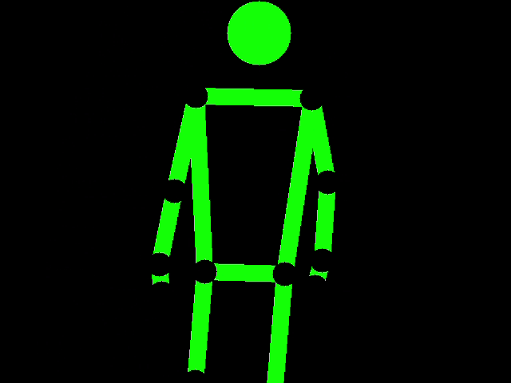
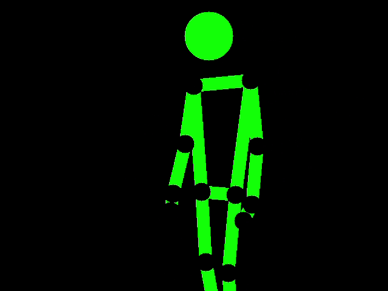

# Learning Pose Estimation
#### Libraries used: open-cv python, numpy & mediapipe
## Stick Man Sim
The stickboy_sim.py mirrors your moves and moves accordingly

## Rep Counter
The pose_test.py counts number of reps in bicep curls.
